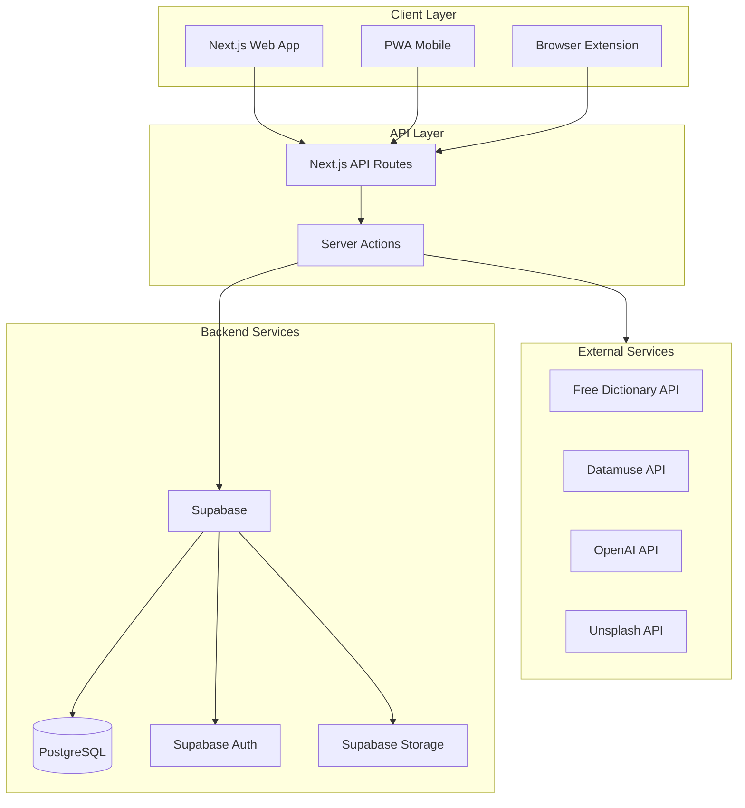
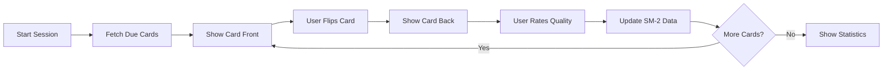
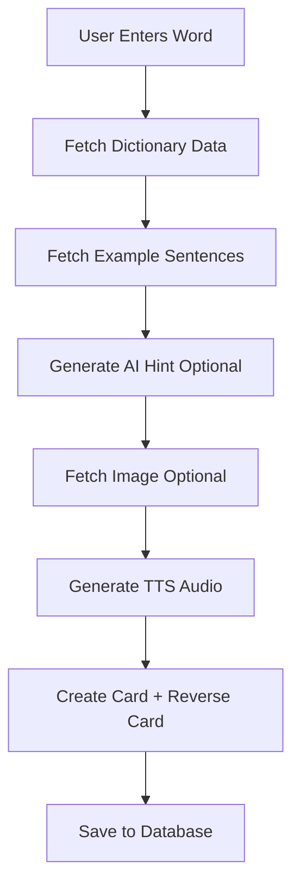
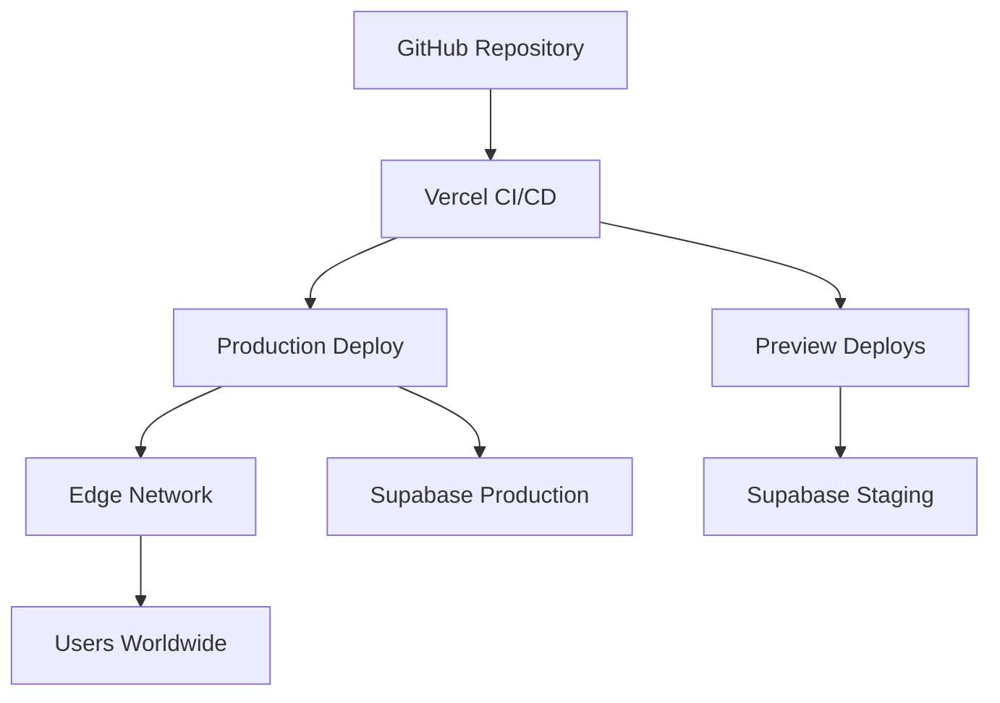

# Flashcard App - Technical Architecture

## Project Overview
A competitive, user-friendly Next.js flashcard web app for English vocabulary review that balances scientific effectiveness (spaced repetition) with frictionless design.

## Technology Stack

### Frontend
- **Framework**: Next.js 14+ (App Router)
- **Language**: TypeScript
- **Styling**: Tailwind CSS
- **UI Components**: Radix UI / shadcn/ui
- **State Management**: React Context + Zustand (for complex state)
- **Forms**: React Hook Form + Zod validation
- **Animations**: Framer Motion

### Backend
- **Database**: Supabase (PostgreSQL)
- **Authentication**: Supabase Auth
- **Storage**: Supabase Storage (for images, audio)
- **API Routes**: Next.js API Routes (App Router)
- **Real-time**: Supabase Realtime (for live updates)

### External APIs & Services
- **Dictionary**: Free Dictionary API (https://dictionaryapi.dev/)
- **Example Sentences**: Datamuse API
- **AI Generation**: OpenAI API (GPT-4 for hints, mnemonics)
- **Text-to-Speech**: Web Speech API + OpenAI TTS (fallback)
- **Images**: Unsplash API
- **Analytics**: Vercel Analytics

### PWA & Mobile
- **PWA**: next-pwa plugin
- **Touch Gestures**: react-swipeable
- **Offline Support**: Service Workers + IndexedDB

### Browser Extension
- **Framework**: Plasmo (modern extension framework)
- **Target**: Chrome, Firefox, Edge

## System Architecture



## Database Schema

### Core Tables

#### users
```sql
- id: uuid (PK)
- email: string
- name: string
- avatar_url: string
- created_at: timestamp
- settings: jsonb (dark_mode, accent_preference, daily_goal)
- streak_count: integer
- last_study_date: date
```

#### decks
```sql
- id: uuid (PK)
- user_id: uuid (FK -> users)
- name: string
- description: text
- is_public: boolean
- tags: string[]
- card_count: integer
- created_at: timestamp
- updated_at: timestamp
```

#### cards
```sql
- id: uuid (PK)
- deck_id: uuid (FK -> decks)
- word: string
- definition: text
- phonetic: string
- part_of_speech: string
- example_sentences: jsonb[]
- image_url: string
- audio_url: string
- context_sentence: text (the sentence where user found the word)
- context_source: string (URL or source)
- ai_hint: text
- card_type: enum (basic, cloze, reverse)
- created_at: timestamp
- updated_at: timestamp
```

#### card_reviews
```sql
- id: uuid (PK)
- card_id: uuid (FK -> cards)
- user_id: uuid (FK -> users)
- ease_factor: float (SM-2 algorithm)
- interval: integer (days until next review)
- repetitions: integer
- next_review_date: timestamp
- last_review_date: timestamp
- quality: integer (0-5, user's rating)
- review_history: jsonb[] (timestamps and ratings)
```

#### shared_decks
```sql
- id: uuid (PK)
- deck_id: uuid (FK -> decks)
- share_token: string (unique)
- created_at: timestamp
- download_count: integer
```

#### pre_made_decks
```sql
- id: uuid (PK)
- name: string
- description: text
- category: string (common_words, business, toefl, etc)
- level: string (A1, A2, B1, B2, C1, C2)
- card_count: integer
- cards_data: jsonb
- created_at: timestamp
```

### Indexes
```sql
CREATE INDEX idx_cards_deck_id ON cards(deck_id);
CREATE INDEX idx_card_reviews_user_id ON card_reviews(user_id);
CREATE INDEX idx_card_reviews_next_review ON card_reviews(next_review_date);
CREATE INDEX idx_decks_user_id ON decks(user_id);
CREATE INDEX idx_shared_decks_token ON shared_decks(share_token);
```

## SM-2 Algorithm Implementation

The SuperMemo 2 (SM-2) algorithm calculates optimal review intervals:

```typescript
interface SM2Result {
  interval: number;      // Days until next review
  repetitions: number;   // Number of successful reviews
  easeFactor: number;    // Difficulty multiplier (1.3 - 2.5)
}

function calculateSM2(
  quality: number,       // 0-5 (Again=0, Hard=2, Good=3, Easy=5)
  repetitions: number,
  easeFactor: number,
  interval: number
): SM2Result {
  let newEaseFactor = easeFactor;
  let newRepetitions = repetitions;
  let newInterval = interval;

  // Update ease factor
  newEaseFactor = Math.max(
    1.3,
    easeFactor + (0.1 - (5 - quality) * (0.08 + (5 - quality) * 0.02))
  );

  // Calculate new interval
  if (quality < 3) {
    // Failed - reset
    newRepetitions = 0;
    newInterval = 1;
  } else {
    newRepetitions += 1;
    if (newRepetitions === 1) {
      newInterval = 1;
    } else if (newRepetitions === 2) {
      newInterval = 6;
    } else {
      newInterval = Math.round(interval * newEaseFactor);
    }
  }

  return {
    interval: newInterval,
    repetitions: newRepetitions,
    easeFactor: newEaseFactor
  };
}
```

### Quality Ratings Mapping
- **0 (Again)**: Complete blackout, wrong response
- **1**: Incorrect but remembered something
- **2 (Hard)**: Correct but very difficult
- **3 (Good)**: Correct with some hesitation
- **4**: Correct with ease
- **5 (Easy)**: Perfect recall, trivial

## Feature Implementation Details

### 1. Smart Study Engine

#### Study Session Flow


#### Cloze Deletion Implementation
```typescript
// Example: "The cat sat on the [mat]."
interface ClozeCard {
  sentence: string;
  clozeDeletions: {
    text: string;
    position: number;
  }[];
}

// Render: "The cat sat on the _____."
// Answer: "mat"
```

### 2. Content Generation Pipeline



#### Auto-Dictionary Lookup
```typescript
async function fetchWordData(word: string) {
  // 1. Free Dictionary API
  const dictData = await fetch(
    `https://api.dictionaryapi.dev/api/v2/entries/en/${word}`
  );
  
  // 2. Datamuse API for sentences
  const sentences = await fetch(
    `https://api.datamuse.com/words?ml=${word}&md=d&max=3`
  );
  
  // 3. OpenAI for AI hint (optional)
  const aiHint = await openai.chat.completions.create({
    messages: [{
      role: "user",
      content: `Create a simple mnemonic for the word "${word}"`
    }]
  });
  
  return {
    definitions: dictData.meanings,
    phonetic: dictData.phonetic,
    sentences: sentences,
    aiHint: aiHint.choices[0].message.content
  };
}
```

### 3. Browser Extension Architecture

```
extension/
├── background.js       # Service worker
├── content.js          # Injected into web pages
├── popup.html          # Extension popup UI
└── manifest.json       # Extension config
```

**Workflow**:
1. User highlights word on any webpage
2. Right-click → "Add to Flashcard"
3. Content script captures word + sentence context + URL
4. Sends to Next.js API via authenticated request
5. Card created with full context preserved

### 4. PWA Configuration

```javascript
// next.config.js
const withPWA = require('next-pwa')({
  dest: 'public',
  register: true,
  skipWaiting: true,
  disable: process.env.NODE_ENV === 'development'
});

module.exports = withPWA({
  // Next.js config
});
```

**Offline Strategy**:
- Cache study sessions in IndexedDB
- Sync when online
- Queue card creations for later sync

### 5. Keyboard Shortcuts

```typescript
const shortcuts = {
  'Space': 'Flip card',
  '1': 'Rate: Again',
  '2': 'Rate: Hard',
  '3': 'Rate: Good',
  '4': 'Rate: Easy',
  'e': 'Edit card',
  'd': 'Toggle dark mode',
  'f': 'Toggle distraction-free mode',
  'n': 'New card',
  's': 'Start study session'
};
```

### 6. Gamification System

#### Streak Calculation
```typescript
function updateStreak(userId: string, lastStudyDate: Date) {
  const today = new Date();
  const daysDiff = differenceInDays(today, lastStudyDate);
  
  if (daysDiff === 1) {
    // Consecutive day - increment streak
    return currentStreak + 1;
  } else if (daysDiff === 0) {
    // Same day - maintain streak
    return currentStreak;
  } else {
    // Streak broken - reset to 1
    return 1;
  }
}
```

#### Vocabulary Size Estimation
```typescript
// Based on word frequency lists (COCA, BNC)
function estimateVocabularySize(matureCards: Card[]) {
  const wordFrequencies = matureCards.map(card => 
    getWordFrequencyRank(card.word)
  );
  
  // Statistical estimation
  const knownWords = wordFrequencies.length;
  const avgRank = mean(wordFrequencies);
  
  // CEFR level mapping
  if (avgRank < 1000) return 'C2';
  if (avgRank < 3000) return 'C1';
  if (avgRank < 5000) return 'B2';
  // ... etc
}
```

## Performance Optimizations

### 1. Caching Strategy
- **Static**: Pre-made decks, public shared decks
- **ISR**: User decks (revalidate every 60s)
- **Client-side**: Study session data, user preferences

### 2. Database Optimization
- Materialized views for analytics
- Partial indexes on frequently queried columns
- Connection pooling via Supabase

### 3. Image Optimization
- Next.js Image component with automatic optimization
- WebP format with fallbacks
- Lazy loading for card images

### 4. Code Splitting
- Dynamic imports for heavy components
- Route-based code splitting (automatic in App Router)
- Lazy load browser extension code

## Security Considerations

1. **Authentication**: Supabase Row Level Security (RLS)
2. **API Rate Limiting**: Upstash Redis for rate limiting
3. **Input Validation**: Zod schemas on client and server
4. **XSS Prevention**: Sanitize user-generated content
5. **CORS**: Restrict API access to known origins

## Deployment Architecture



**Environments**:
- **Development**: Local + Supabase local dev
- **Staging**: Vercel preview + Supabase staging
- **Production**: Vercel production + Supabase production

## Monitoring & Analytics

1. **Error Tracking**: Sentry
2. **Performance**: Vercel Analytics + Web Vitals
3. **User Analytics**: Custom events (study sessions, cards created)
4. **Database Monitoring**: Supabase dashboard

## Future Enhancements (Phase 2)

1. **Collaborative Decks**: Multiple users can contribute
2. **AI-Powered Difficulty Adjustment**: ML model for personalized SRS
3. **Voice Input**: Create cards via speech
4. **Social Features**: Friends, leaderboards, challenges
5. **Advanced Analytics**: Learning curves, weak areas identification
6. **Multi-language Support**: Beyond English vocabulary
7. **Native Mobile Apps**: React Native or Flutter
8. **Spaced Repetition for Sentences**: Not just words

## Development Phases

### Phase 1: MVP (Weeks 1-4)
- Core study engine with SM-2
- Basic card creation
- Authentication
- Mobile-responsive UI

### Phase 2: Enhanced Features (Weeks 5-8)
- Auto-dictionary lookup
- AI integration
- Browser extension
- Gamification

### Phase 3: Polish & Scale (Weeks 9-12)
- Performance optimization
- Pre-made decks
- Sharing functionality
- Comprehensive testing

## Success Metrics

1. **User Engagement**: Daily active users, study sessions per user
2. **Retention**: 7-day, 30-day retention rates
3. **Learning Effectiveness**: Cards reaching "mature" status
4. **Performance**: Page load time < 2s, Time to Interactive < 3s
5. **Conversion**: Free to paid (if monetized)

## Conclusion

This architecture provides a solid foundation for a competitive flashcard app that balances scientific effectiveness with user experience. The modular design allows for iterative development and easy feature additions.